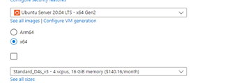

# Deploying to Cluster

## Creating the Clusters

Create 5 VMs with the following configuration:



## Connecting to Clusters

Make sure you have the Azure CLI installed and are logged in.

```bash

Create the following two files, while connected to the MSFT VPN.

```powershell
# Add-VpnRoute.ps1

param(
  [parameter(mandatory = $true)]
  [string]$VmName,
  [parameter()]
  [string]$AzureSubscription
)

if (-not [bool](Get-Command -ErrorAction SilentlyContinue az)) {
  Write-Error "Azure CLI (az) not found. Please install it and run 'az login' before using this script"
  return
}

Write-Host "**Remember to run 'az login' first!"

$args = @('--name', $VmName)
if ($AzureSubscription) {
  $args += '--subscription', $AzureSubscription
}

$destination = az vm list-ip-addresses @args -o tsv --query "[0].virtualMachine.network.publicIpAddresses[0].ipAddress"
if (-not $destination) {
  Write-Error "Couldn't find the public IP address for VM '$VmName' in subscription '$AzureSubscription'"
  return;
}

$interface = Get-NetIPAddress -AddressFamily IPv4 -InterfaceAlias MSFTVPN-Manual | foreach { $_.IPAddress }
if (-not $interface) {
  Write-Error "Couldn't find a local network interface named 'MSFTVPN'"
  return;
}

Write-Host "Adding destination '$destination' to MSFTVPN interface '$interface'..."
route add $destination $interface
```

```powershell
# install.ps1

az account clear
Set-ExecutionPolicy -Scope Process -ExecutionPolicy Bypass
az login

az account set --subscription iot-edge-sublib-003

. .\Add-VpnRoute.ps1 stress-1 iot-edge-sublib-003
#ssh -i azureKey.pem azureuser@20.127.195.100

. .\Add-VpnRoute.ps1 stress-2 iot-edge-sublib-003
#ssh -i azureKey.pem azureuser@20.127.148.26

. .\Add-VpnRoute.ps1 stress-3 iot-edge-sublib-003
#ssh -i azureKey.pem azureuser@20.127.144.89

. .\Add-VpnRoute.ps1 stress-4 iot-edge-sublib-003
#ssh -i azureKey.pem azureuser@20.127.145.182

. .\Add-VpnRoute.ps1 stress-5 iot-edge-sublib-003
#ssh -i azureKey.pem azureuser@20.127.146.229
```

Run the following to connect to the VMs:

```powershell
. .\install.ps1
```

This should add the necessary networking to allow your local machine to connect to the VMs.

## Local SSH

Locally, you can create a `~/.ssh/config` file with the following:

```
Host stress-1
    HostName 74.123.123.138
    User azureuser
    IdentityFile /home/dwalton/keys/stress-1_key.pem

Host stress-2
    HostName 74.123.122.97
    User azureuser
    IdentityFile /home/dwalton/keys/stress-2_key.pem

Host stress-3
    HostName 74.123.122.216
    User azureuser
    IdentityFile /home/dwalton/keys/stress-3_key.pem

Host stress-4
    HostName 74.123.123.28
    User azureuser
    IdentityFile /home/dwalton/keys/stress-4_key.pem

Host stress-5
    HostName 74.123.123.29
    User azureuser
    IdentityFile /home/dwalton/keys/stress-5_key.pem
```

Your `ssh` command would be something like the following:

```bash
ssh azureuser@stress-1 -F ~/.ssh/config
```

## Prereqs

```bash
sudo apt install build-essential erlang cmake libatomic1 make mosquitto mosquitto-clients
```

## Installing K3S

[Install k3s](https://docs.k3s.io/quick-start)

```bash
mkdir ~/.kube 2> /dev/null
cd ~/.kube
touch config
sudo k3s kubectl config view --raw > config
chmod 600 config
# You can add this to your .bashrc so that each ssh session has the correct config
export KUBECONFIG=~/.kube/config
```

Run the following on the master node (first VM):

```bash
curl -sfL https://get.k3s.io | sh -

# Get the token from here for the next step (might need sudo)
cat /var/lib/rancher/k3s/server/node-token
```

On each auxiliary node, run the following, replacing the items in brackets with the values from the master node:

```bash
curl -sfL https://get.k3s.io | K3S_URL=https://<myserver-local-ip>:6443 K3S_TOKEN=<mynodetoken> sh -
```

## Install emqx

```bash
git clone https://github.com/emqx/emqtt-bench.git
cd emqtt-bench
make
```

## (Optional) Create your own ACR

You can create your own container registry to store your images. This is useful if you want to build your own images and push them to your own registry.

Create the container registry on Azure and get your admin username and password.

```bash
docker login <username>
# Enter your password

# Then enable anonymous pull access
az acr update --name <acr-repo> --anonymous-pull-enabled
```

## Install E4K

### deployment.yaml

Create the following deployment file to deploy the E4K broker to the nodes:

```yaml
# deployment.yaml
apiVersion: az-edge.com/v1alpha2
kind: Broker
metadata:
  name: "dmqttbroker"
  namespace: default
spec:
  mode: distributed
  healthManagerImage:
    pullPolicy: Always
    repository: edgebuilds.azurecr.io/dmqtt-operator
    tag: edge
  brokerImage:
    pullPolicy: Always
    repository: edgebuilds.azurecr.io/dmqtt-pod
    tag: edge
  authImage:
    pullPolicy: Always
    repository: edgebuilds.azurecr.io/dmqtt-authentication
    tag: edge
  cardinality:
    frontend:
      replicas: 3
      temporaryResourceLimits:
        maxInflightMessages: 1000
        maxInflightPatches: 1000
        maxInflightPatchesPerClient: 1
        maxMessageExpirySecs: 3600
        maxQueuedMessages: 1000000000
        maxQueuedQos0Messages: 2000
        maxSessionExpirySecs: 3600
    backendChain:
      replicas: 2
      chainCount: 6
      temporaryResourceLimits:
        maxInflightMessages: 1000
        maxInflightPatches: 1000
        maxInflightPatchesPerClient: 1
        maxMessageExpirySecs: 3600
        maxQueuedMessages: 1000000000
        maxQueuedQos0Messages: 2000
        maxSessionExpirySecs: 3600
---
apiVersion: az-edge.com/v1alpha2
kind: BrokerListener
metadata:
  name: "e4klistener"
  namespace: default
spec:
  brokerRef: "dmqttbroker"
  serviceType: loadBalancer
  authenticationEnabled: false
  authorizationEnabled: false
  port: 1883
---
apiVersion: az-edge.com/v1alpha2
kind: BrokerDiagnostic
metadata:
  name: "my-diag"
  namespace: default
spec:
  brokerRef: "dmqttbroker"
  diagnosticServiceEndpoint: azedge-diagnostics-service:9700
  enableMetrics: true
  enableTracing: true
  logLevel: debug,hyper=off,kube_client=off,tower=off,conhash=off,h2=off
  enableSelfCheck: false
```

### Deploy

```bash
helm package E4K_CRD && helm install e4k az-e4k-0.3.0-dev-crd.tgz -f E4K_CRD/values.yaml && kubectl apply -f E4K_CRD/deployment.yaml
```

## Push local containers to registry

```bash
clear; for d in operatord authd; do make "MANIFEST=./dmqtt/$d/Cargo.toml" STRIP=1 image TAGS='{{repository}}'; done; make MANIFEST=./dmqtt/dmqttd/Cargo.toml RELEASE=1 STRIP=1 image TAGS='{{repository}}'

docker tag dmqtt-operator dwaltonacr.azurecr.io/dmqtt-operator:wip
docker tag dmqtt-authentication dwaltonacr.azurecr.io/dmqtt-authentication:wip
docker tag dmqtt-pod dwaltonacr.azurecr.io/dmqtt-pod:wip

docker push dwaltonacr.azurecr.io/dmqtt-operator:wip
docker push dwaltonacr.azurecr.io/dmqtt-authentication:wip
docker push dwaltonacr.azurecr.io/dmqtt-pod:wip
```

## Deleting the CRDs for a redeploy

```bash
helm delete e4k ; kubectl patch brokers/dmqttbroker -p '{"metadata":{"finalizers":[]}}' --type=merge ; kubectl delete crd  brokers.az-edge.com brokerauthentications.az-edge.com  brokerauthorizations.az-edge.com brokerdiagnostics.az-edge.com brokerlisteners.az-edge.com  brokers.az-edge.com diagnosticservices.az-edge.com mqttbridgetopicmaps.az-edge.com mqttbridgeconnectors.az-edge.com
```

## Situations to Test

```bash
# Get frontend IP to use for testing
export FRONTEND_IP=$(kubectl get services | grep frontend | awk '{print $3}')

# Backlog of messages to sustained session

# Connect with persistent session
mosquitto_sub -q 1 -t "#" -i sub_2 -d -V mqttv5 -h $FRONTEND_IP -c

# Send a bunch of messages, which should eventually get rejected
mosquitto_pub -t test -d -h $FRONTEND_IP -q 1 -m <1 Kb payload> --repeat 1000000 -V mqttv5

# Dummy subscriber which should get rejected
mosquitto_sub -q 1 -t "test" -i dummy -d -V mqttv5 -h $FRONTEND_IP

mosquitto_pub -t test -d -h $FRONTEND_IP -q 1 -i pubber -m aaaaaaaaaaaaaaaaaaaaaaaaaaaaaaaaaaaaaaaaaaaaaaaaaaaaaaaaaaaaaaaaaaaaaaaaaaaaaaaaaaaaaaaaaaaaaaaaaaaaaaaaaaaaaaaaaaaaaaaaaaaaaaaaaaaaaaaaaaaaaaaaaaaaaaaaaaaaaaaaaaaaaaaaaaaaaaaaaaaaaaaaaaaaaaaaaaaaaaaaaaaaaaaaaaaaaaaaaaaaaaaaaaaaaaaaaaaaaaaaaaaaaaaaaaaaaaaaaaaaaaaaaaaaaaaaaaaaaaaaaaaaaaaaaaaaaaaaaaaaaaaaaaaaaaaaaaaaaaaaaaaaaaaaaaaaaaaaaaaaaaaaaaaaaaaaaaaaaaaaaaaaaaaaaaaaaaaaaaaaaaaaaaaaaaaaaaaaaaaaaaaaaaaaaaaaaaaaaaaaaaaaaaaaaaaaaaaaaaaaaaaaaaaaaaaaaaaaaaaaaaaaaaaaaaaaaaaaaaaaaaaaaaaaaaaaaaaaaaaaaaaaaaaaaaaaaaaaaaaaaaaaaaaaaaaaaaaaaaaaaaaaaaaaaaaaaaaaaaaaaaaaaaaaaaaaaaaaaaaaaaaaaaaaaaaaaaaaaaaaaaaaaaaaaaaaaaaaaaaaaaaaaaaaaaaaaaaaaaaaaaaaaaaaaaaaaaaaaaaaaaaaaaaaaaaaaaaaaaaaaaaaaaaaaaaaaaaaaaaaaaaaaaaaaaaaaaaaaaaaaaaaaaaaaaaaaaaaaaaaaaaaaaaaaaaaaaaaaaaaaaaaaaaaaaaaaaaaaaaaaaaaaaaaaaaaaaaaaaaaaaaaaaaaaaaaaaaaaaaaaaaaaaaaaaaaaaaaaaaaaaaaaaaaaaaaaaaaaaaaaaaaaaaaaaaaaaaaaaaaaaaaaaaaaaaaaaaaaaaaaaaaaaaaaaaaaaaaaaaaaaaaaaaaaaaaaaaaaaaaaaaaaaaaaaaaaaaaaaaaaaaaaaaaaaaaaaaaaaaaaaaaaaaaaaaaaaaaaaaa --repeat 1000000 -V mqttv5 -c
```

```
# 1KB payload
aaaaaaaaaaaaaaaaaaaaaaaaaaaaaaaaaaaaaaaaaaaaaaaaaaaaaaaaaaaaaaaaaaaaaaaaaaaaaaaaaaaaaaaaaaaaaaaaaaaaaaaaaaaaaaaaaaaaaaaaaaaaaaaaaaaaaaaaaaaaaaaaaaaaaaaaaaaaaaaaaaaaaaaaaaaaaaaaaaaaaaaaaaaaaaaaaaaaaaaaaaaaaaaaaaaaaaaaaaaaaaaaaaaaaaaaaaaaaaaaaaaaaaaaaaaaaaaaaaaaaaaaaaaaaaaaaaaaaaaaaaaaaaaaaaaaaaaaaaaaaaaaaaaaaaaaaaaaaaaaaaaaaaaaaaaaaaaaaaaaaaaaaaaaaaaaaaaaaaaaaaaaaaaaaaaaaaaaaaaaaaaaaaaaaaaaaaaaaaaaaaaaaaaaaaaaaaaaaaaaaaaaaaaaaaaaaaaaaaaaaaaaaaaaaaaaaaaaaaaaaaaaaaaaaaaaaaaaaaaaaaaaaaaaaaaaaaaaaaaaaaaaaaaaaaaaaaaaaaaaaaaaaaaaaaaaaaaaaaaaaaaaaaaaaaaaaaaaaaaaaaaaaaaaaaaaaaaaaaaaaaaaaaaaaaaaaaaaaaaaaaaaaaaaaaaaaaaaaaaaaaaaaaaaaaaaaaaaaaaaaaaaaaaaaaaaaaaaaaaaaaaaaaaaaaaaaaaaaaaaaaaaaaaaaaaaaaaaaaaaaaaaaaaaaaaaaaaaaaaaaaaaaaaaaaaaaaaaaaaaaaaaaaaaaaaaaaaaaaaaaaaaaaaaaaaaaaaaaaaaaaaaaaaaaaaaaaaaaaaaaaaaaaaaaaaaaaaaaaaaaaaaaaaaaaaaaaaaaaaaaaaaaaaaaaaaaaaaaaaaaaaaaaaaaaaaaaaaaaaaaaaaaaaaaaaaaaaaaaaaaaaaaaaaaaaaaaaaaaaaaaaaaaaaaaaaaaaaaaaaaaaaaaaaaaaaaaaaaaaaaaaaaaaaaaaaaaaaaaaaaaaaaaaaaaaaaaaaaaaa
```

## Get Support Bundle

```bash
scp -F ~/keys/config dwalton@stress-1:~/bundle.zip .
```

## Deploying with certain affinity

### Creating labels for nodes

```bash
kubectl label nodes stress-1 nodeid=stress-1
kubectl label nodes stress-2 nodeid=stress-2
kubectl label nodes stress-3 nodeid=stress-3
kubectl label nodes stress-4 nodeid=stress-4
kubectl label nodes stress-5 nodeid=stress-5
```

You can then use the Affinity in Rust to create an affinity option similar to the following:

```rust
affinity: Some(Affinity {
  node_affinity: Some(NodeAffinity {
      preferred_during_scheduling_ignored_during_execution: None,
      required_during_scheduling_ignored_during_execution: Some(NodeSelector {
          node_selector_terms: vec![NodeSelectorTerm {
              match_expressions: Some(vec![NodeSelectorRequirement {
                  key: "nodeid".to_string(),
                  operator: "In".to_string(),
                  values: Some(vec!["stress-1".to_string()]),
              }]),
              match_fields: None,
          }],
      }),
  }),
  pod_affinity: None,
  pod_anti_affinity: None,
}),
```

## My Personal Items

```bash
curl -sfL https://get.k3s.io | K3S_URL=https://10.0.0.4:6443 K3S_TOKEN="K10f9e9aa4834d2970ec6c7e7d04d8962e85bed0f410ecfc6df825d5f93da2a7d9b::server:bc36674877fc50437d481d678aec36ef" sh -
```

Create `deployment.yaml` in `distrib/kube

```yaml
apiVersion: az-edge.com/v1alpha2
kind: Broker
metadata:
  name: "dmqttbroker"
  namespace: default
spec:
  mode: distributed
  healthManagerImage:
    pullPolicy: Always
    repository: edgebuilds.azurecr.io/dmqtt-operator
    tag: edge
  brokerImage:
    pullPolicy: Always
    repository: edgebuilds.azurecr.io/dmqtt-pod
    tag: edge
  authImage:
    pullPolicy: Always
    repository: edgebuilds.azurecr.io/dmqtt-authentication
    tag: edge
  cardinality:
    frontend:
      replicas: 5
      temporaryResourceLimits:
        maxInflightMessages: 1000
        maxInflightPatches: 1000
        maxInflightPatchesPerClient: 1
        maxMessageExpirySecs: 3600
        maxQueuedMessages: 1000000000
        maxQueuedQos0Messages: 2000
        maxSessionExpirySecs: 3600
    backendChain:
      replicas: 2
      chainCount: 5
      temporaryResourceLimits:
        maxInflightMessages: 1000
        maxInflightPatches: 1000
        maxInflightPatchesPerClient: 1
        maxMessageExpirySecs: 3600
        maxQueuedMessages: 1000000000
        maxQueuedQos0Messages: 2000
        maxSessionExpirySecs: 3600
---
apiVersion: az-edge.com/v1alpha2
kind: BrokerListener
metadata:
  name: "e4klistener"
  namespace: default
spec:
  brokerRef: "dmqttbroker"
  serviceType: loadBalancer
  authenticationEnabled: false
  authorizationEnabled: false
  port: 1883
---
apiVersion: az-edge.com/v1alpha2
kind: BrokerDiagnostic
metadata:
  name: "my-diag"
  namespace: default
spec:
  brokerRef: "dmqttbroker"
  diagnosticServiceEndpoint: azedge-diagnostics-service:9700
  enableMetrics: true
  enableTracing: true
  logLevel: debug,hyper=off,kube_client=off,tower=off,conhash=off,h2=off
  enableSelfCheck: false
```
